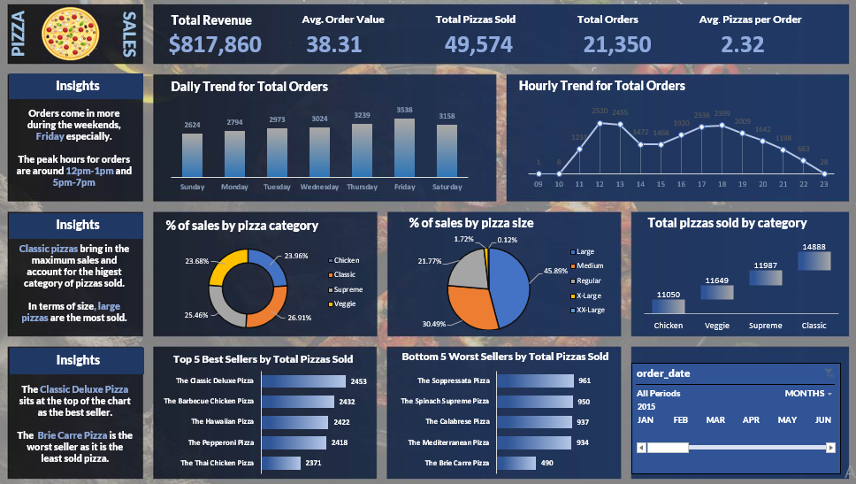

# Dominion Pizza Sales Analysis and Interactive Dashboard

## Table of Contents
- [Project Overview](#project-overview)
- [Project Objectives](#project-objectives)
- [Dashboard Overview](#dashboard-overview)
- [Key Performance Indicators](#key-performance-indicators)
- [Methodology](#methodology)
- [Files](#files)
- [Tools and Techniques](#tools-and-techniques)
- [Key Insights](#key-insights)
- [Recommendations](#recommendations)
- [Contact Information](#contact-information)

## Project Overview
This project analyzes sales data from Dominion Pizza Company to provide actionable insights for improving sales and understanding customer behavior. The final deliverable is an interactive Excel dashboard that highlights key performance indicators (KPIs) and trends in pizza sales.

## Project Objectives
The primary goals of this analysis were:
- To calculate key performance metrics such as Total Revenue, Average Order Value, Total Pizzas Sold, etc.
- To visualize daily and hourly order trends, helping identify peak sales periods.
- To analyze sales by pizza category and size to understand customer preferences.
- To determine the top 5 best-selling and bottom 5 worst-selling pizza options.
- To create an interactive dashboard for stakeholders to explore these insights.

## Dashboard Overview
The interactive dashboard includes:
- **Bar Charts** for daily trends and best/worst sellers.
- **Line Charts** for hourly trends in orders.
- **Pie Charts** for sales distribution by pizza category and size.
- **Funnel Chart** to compare pizza category performance.
- **Timeline Filter** for dynamic date filtering.

### Screenshot of the Dashboard:

## Key Performance Indicators
The following KPIs were calculated:
1. **Total Revenue**: $817,860  
2. **Average Order Value**: $38.31  
3. **Total Pizzas Sold**: 49,574  
4. **Total Orders**: 21,350  
5. **Average Pizzas per Order**: 2.32  

## Methodology
The analysis involved the following steps:
1. **Data Collection**: The dataset was downloaded from an online source and contained 12 columns and 48,620 rows.
2. **Data Preparation**: Data was imported into SQL Server, cleaned, and queried to calculate the KPIs. Some columns (e.g., pizza sizes) were standardized, and duplicate order IDs were addressed.
3. **Dashboard Creation**: An interactive Excel dashboard was built using pivot tables and charts connected to the SQL database. A timeline filter was added for enhanced interactivity.

## Files
- **Dataset**: You can check out the Excel workbook containing the cleaned data and the interactive dashboard here: [Excel Workbook](https://docs.google.com/spreadsheets/d/1tkPNKJf4eyypxVRlH9f3Ofo35FSiqrx2/edit?usp=drive_link&ouid=118110181468829394233&rtpof=true&sd=true).
- **Documentation**: The in-depth analysis report can be downloaded here: [Data_Cleaning_and_Analysis_Report.pdf](Dominion_Pizza_Data_Cleaning_and_Analysis_Report.pdf)

## Tools and Techniques
- **SQL Server Management Studio**: Data analysis and KPI extraction.
- **Microsoft Excel**: Dashboard creation and interactivity.
- **Text Functions in Excel**: For data cleaning and processing.

## Key Insights
- Orders peak during weekends, particularly on Fridays.
- The most active hours for orders are 12 PM-1 PM and 5 PM-7 PM.
- **Classic Pizzas** generate the highest sales, with **Large Pizzas** being the most popular size.
- The **Classic Deluxe Pizza** is the best-selling pizza, while the **Brie Carre Pizza** is the least sold.

## Recommendations
- Introduce happy-hour discounts or meal combos targeting the most active hours to attract even more customers.
- Design specific campaigns (e.g., "Weekend Feast Deal") to maximize sales during high-traffic days like Fridays and Saturdays.
- The company can upsell or create bundle offers e.g., creating a combo deal featuring the best-selling Classic Deluxe Pizza and Large Pizzas (e.g., "Deluxe Combo" with a drink and maybe a side dish).
- Conduct customer surveys to understand why the Brie Carre pizza is not popular. Is it the flavor, price, or lack of awareness?.
- In addition, increasing staffing levels during peak periods will help in handling higher order volumes and reducing delivery time.
- Regularly analyze sales trends to identify items that need promotion or removal from the menu.
- From my analysis, I assume loyal customers are likely contributing significantly to repeat sales, hence, the need to introduce a customer loyalty program (e.g., points-based rewards) to encourage repeat orders or provide incentives for existing customers to refer new customers (e.g., "Refer a Friend and Get a Free Pizza").
  
## Contact Information
Feel free to reach out with feedback or questions:
- **Email**: [akinolaiyin@gmail.com]

---

